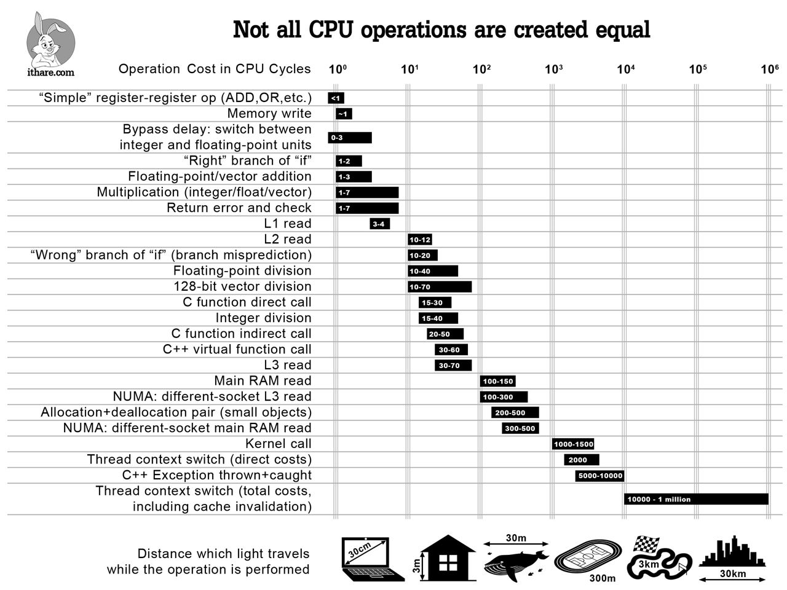

### Part III. Хорошие и плохие решения. Примеры

### 1. using namespace

Включать целый namespace опасно, так как из-за этого может возникнуть конфликт имен. Вследствие чего могут возникнуть нетривиальные ошибки компиляции/линковки, а если не повезет, то переменная из namespace может совпасть по названию с какой-то вашей переменной, про которую вы не помните ее область видимости, что приведет к еще более сложнонаходимым багам, хоть все и скомпилируется, но иногда вы будете использовать переменную, думая, что это ваша переменная, и в ней такое-то значение, а значение будет совсем другим. Кроме того, включая namespace, вы нарушаете сам принцип использования namespace'ов.

(c) @radmickey

```C++
// плохо

#include <string>

using namespace std;

int main() {
    string str = "hello world";
}

// хорошо

#include <string>

int main() {
    std::string str = "hello world";
}
```
### 2. Библиотеки языка Си

Не используйте библиотеки языка Си (они заканчиваются на `.h`). Используйте плюсовые аналоги, у них такой же название, только без `.h` в конце и с `c` в начале.

```C++
#include <math.h> // плохо

#include <cmath> // хорошо
```

### 3. const reference

`int`, `char`, `float`, `char*` и т.д. это примитивы. Если вы передаете в функцию/метод не примитивный объект и хотите работать именно с ним (а не с копией), то передавайте его по ссылке (`&`). Если в функции вы его не меняете, то используйте константную ссылке (`const&`).

```C++
void printString(std::string str) { // плохо
    std::cout << str << std::endl;
}

void printString(const std::string& str) { // хорошо
    std::cout << str << std::endl;
}
```

[Тут](https://stackoverflow.com/questions/2627166/what-is-the-difference-between-a-const-reference-and-normal-parameter) можно почитать про const reference.

### 4. Приведение типов

Если вы хотите привести один примитивный тип к другому (т.е. скастить), то используйте C++ cast, а не C-style каст.

```C++
char ch = 'a';
uint64_t ch_uint = ch; // очень плохо

char ch = 'a';
uint64_t ch_uint = (char)ch; // плохо

char ch = 'a';
uint64_t ch_uint = static_cast<uint64_t>(ch); // хорошо
```

### 5. Инвертирование условий

Старайтесь избегать большой вложенности кода, где это возможно. Это позволит писать более чистый и поддерживаемый код

```C++
std::ifstream file(filename);
if (file.is_open()) { // плохо
     // code
} else {
    return EXIT_FAILURE;
}

if (!ok) { // хорошо
    return EXIT_FAILURE;
}

// code
```

### 6. Try-catch

Многие используют `try`/`catch` в паре с `std::stoi`, чтобы проверить что строка корректно конвертировалась в число. Теперь посмотрите на этот график:



Видно, что `try`/`catch` очень затратные по времени операции, и нужно понимать, на что вы идёте когда их используете. Есть функции по типу `std::strtoll`/`std::from_chars` которые дадут вам информацию о том, прошло ли конвертирование успешно, и без исключений. 

### 7. Работа с указателями

Допустим, дана строка, в которой сначала идут буквы, а потом идет число, и
требуется получить это число в явном виде. Это можно сделать следующим образом:

```C++
int main() {
  const char* str = "sometext42";

  while (*str != '\0' && !std::isdigit(*str)) {
    ++str;
  }
  int x = std::atoi(str); // x = 42
}
```

### 8. Разбиение на функции

Иногда в коде могут возникать трудные для чтения участки. Рассмотрим такой пример:

```C++
if (!(strlen(arguments[i]) == 2 || (arguments[i][0] == 'x' && strlen(arguments[i]) == 3) || (arguments[i][0] == 'o' && strlen(arguments[i]) == 4))) {
  ...
}
```

Это условие выглядит сложным и сходу сложно сказать, что оно делает. Помимо этого строчка получается очень длинной, что не очень хорошо. Эту проблему можно решить следующим образом:

```C++
if (!(
   // длина либо 2
  strlen(arguments[i]) == 2 ||
  // либо 3, но тогда первый символ это 'x'
  (argument[0] == 'x' && strlen(arguments[i]) == 3) ||
  // либо 4, но тогда первый символ это 'o'
  (argument[0] == 'o' && strlen(arguments[i]) == 4))
) {
  ...
}
```

Разбиение на строки позволило уменьшить длину строки, а комментарий внес немного ясности, чтобы сходу можно было разобраться, что тут проверяется. Но это все еще достаточно плохой вариант. Теперь рассмотрим правильный подход к решению этой проблемы:

```C++
bool IsStringCorrect(const char* argument) {
  std::size_t len = std::strlen(argument);
  return (len == 2)
    || (len == 3 && argument[0] == 'x')
    || (len == 4 && argument[0] == 'o');
}

if (!IsStringCorrect(arguments[i])) {
  ...
}
```

+ Название функции заменяет собой комментарий и дает необходимую информацию о том, что собственно проверяется. Теперь при чтении когда можно не вдаваться в подробности того, как проверяется строка, а просто видеть, что происходит ее проверка.
+ Внутри функции можно использовать сокращения (`std::size_t len = std::strlen(argument)`), чтобы не писать одно и то же, а также чтобы сделать строчку короче.
+ Функция очень короткая и можно достаточно легко понять, что она делает.
+ Эту функцию можно удобно переиспользовать в других частях кода и с другим аргументом в отличие от предыдущих двух вариантов, где бы пришлось копировать код и переписывать имя аргумента.
