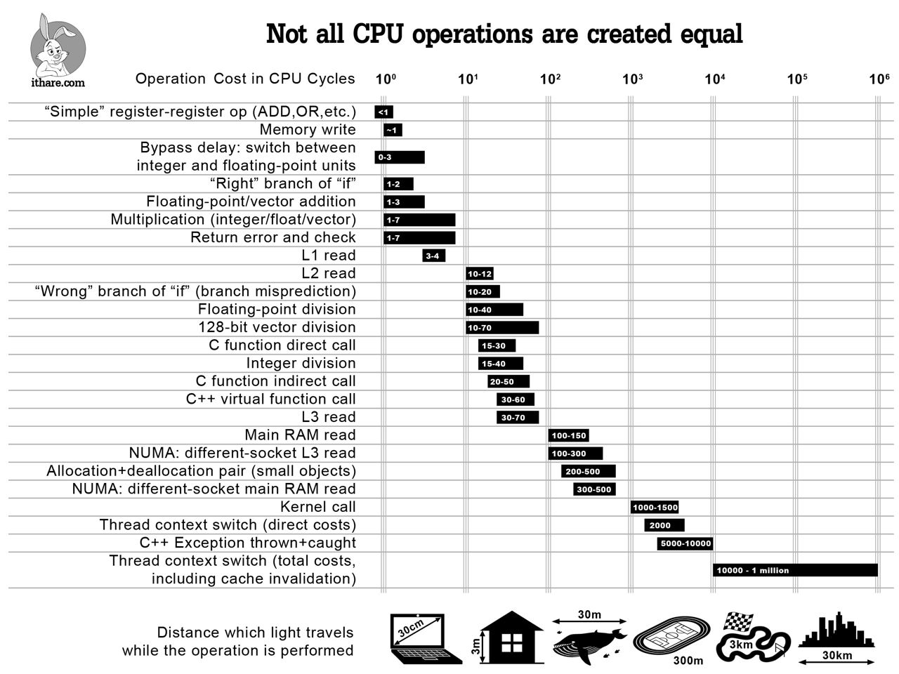

### Part IV. Разборы плохих и хороший решений

### 1. Try/Catch

Многие используют try/catch в паре с std::stoi чтобы проверить что строка корректно сконвертировалась в число. Теперь посмотрите на этот график:

Здесь видно, что try/catch очень затратные по времени операции, и нужно понимать, на что вы идёте когда их используете. Есть функции по типу std::strtoll/std::from_chars которые дадут вам информацию о том, прошло ли конвертирование успешно без исключений. 

